# 🧠 LLM-Powered Chatbot in a Python Microservice Platform

## [ChatGPT Chat](https://chatgpt.com/share/68780360-a454-8002-8c1d-7a88245b002b)
## [EC2 Deployment URL](https://api.ssm-chatbot.online/health/all)

The microservices are deployed on an EC2 free-tier instance.  
Services are available on demand or during **10:00 AM – 5:00 PM IST**.  

A Postman collection is also attached for testing the microservices.  

For on-demand access, please contact me at: **swayam.swaroop175@gmail.com**

A step-by-step implementation roadmap for building an LLM-based chatbot in Python to showcase **backend engineering**, **low-level design (LLD)**, and **AI integration**.

## 📋 Prerequisites

Before you begin, ensure you have the following installed:

*   **Python 3.11** or higher
*   **Poetry** for dependency management
*   **Docker** and **Docker Compose** for containerization
*   **Git** for version control

## 🏛️ Project Architecture

This project is designed using a microservice architecture. Each service is independently deployable and scalable. The services communicate with each other through a well-defined API, with an API Gateway acting as the single entry point for all client requests.

```mermaid
graph TD
    subgraph "User Interaction"
        User("👤 User")
    end

    subgraph "Services"
        APIGateway("API Gateway")
        AuthService("Authentication Service")
        ChatbotService("Chatbot Service")
        ConversationService("Conversation Service")
    end

    subgraph "Data Stores"
        Postgres("🐘 PostgreSQL")
        Redis("⚡ Redis")
        ChromaDB("🧠 ChromaDB (Vector DB)")
    end

    subgraph "External Services"
        Gemini("✨ Gemini LLM")
    end

    User -->|HTTPS Request| APIGateway

    APIGateway -->|"Routes to /auth"| AuthService
    APIGateway -->|"Routes to /chat"| ChatbotService
    APIGateway -->|"Routes to /conversation"| ConversationService
    APIGateway -->|"Rate Limiting"| Redis

    AuthService -->|"Stores Users & Tokens"| Postgres
    ChatbotService -->|"Retrieves/Stores Convo History"| ConversationService
    ChatbotService -->|"Generates Response"| Gemini
    ConversationService -->|"Stores Messages"| Postgres
    ConversationService -->|"Caches Data"| Redis
    ConversationService -->|"Semantic Search"| ChromaDB
```



### Services

*   **API Gateway**: The single entry point for all client requests. It routes requests to the appropriate microservice and handles cross-cutting concerns like authentication (JWT validation) and rate limiting.
*   **Authentication Service**: Manages user registration, login, and JWT-based authentication (access and refresh tokens). It stores user credentials and refresh tokens in the PostgreSQL database.
*   **Chatbot Service**: Integrates with the Google Gemini LLM to generate chat responses. It communicates with the Conversation Service to maintain conversation history.
*   **Conversation Service**: Manages the storage and retrieval of conversation history. It uses PostgreSQL for storing conversation data and ChromaDB for enabling semantic search on conversation history. Redis is used for caching.

### Data Stores

*   **PostgreSQL**: The primary relational database for the Authentication Service (users, refresh tokens) and the Conversation Service (conversation history).
*   **Redis**: Used for caching frequently accessed data to reduce latency.
*   **ChromaDB**: A vector database used to store embeddings of conversation history, enabling powerful semantic search capabilities.

## 🚀 Deployment with Docker

The entire platform can be easily deployed using Docker and Docker Compose. A `Makefile` is provided in the `llm-chatbot-services` directory to simplify the process.

### Prerequisites

*   Docker
*   Docker Compose
*   `make` (optional, but recommended for convenience)

### Steps

1.  **Navigate to the services directory:**
    ```bash
    cd llm-chatbot-services
    ```

2.  **Build and start all services:**
    This command will build the Docker images for all services and start the containers in detached mode.
    ```bash
    make start-all
    ```
    Alternatively, you can use `docker-compose` directly:
    ```bash
    docker-compose up --build -d
    ```

3.  **Stopping the services:**
    To stop all running containers, use:
    ```bash
    make down
    ```
    Or:
    ```bash
    docker-compose down
    ```

### Useful Commands

The `Makefile` in `llm-chatbot-services` includes several other useful commands:

*   `make restart-all`: Restart all services.
*   `make logs`: Tail the logs from all services.
*   `make shell service=auth-service`: Access the shell of a specific service container.